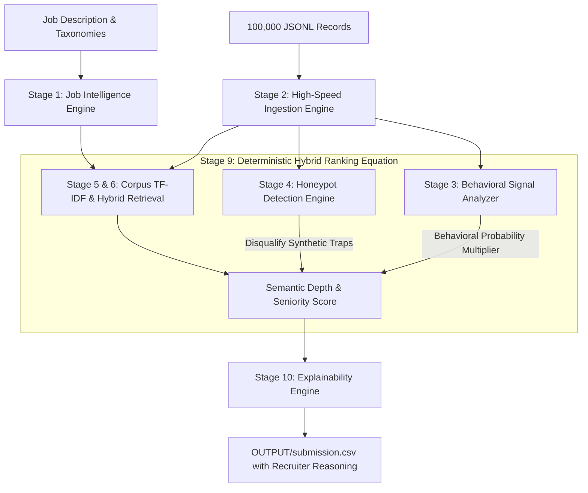

# 🚀 Enterprise AI Candidate Discovery & Ranking System

[](https://redrob.io)
[-10b981?style=for-the-badge)]()
[-f59e0b?style=for-the-badge)]()
[]()
[]()

> **Architected by Team Titan**  
> *(IT & CS Undergraduate Developers — Jayesh Kadam, Manoj Chavan, Lalit Ahire)*  
> Engineered specifically for the **Redrob Founding Team Senior AI Engineer Mandate**, delivering high-precision talent discovery that eliminates keyword-stuffing noise and models real-world hiring availability.

---

## 🏗️ Executive Summary & The Recruitment Challenge

Conventional recruiting filters rely on naive vector similarity or boolean resume scraping (`"RAG" AND "LangChain"`). This introduces severe systemic vulnerabilities:
1. **The Keyword Stuffing Trap**: Junior candidates easily manipulate cosine similarity scores by listing dozens of popular wrapper frameworks.
2. **The Seniority Blindspot**: Exceptional architects building custom, distributed retrieval infrastructure describe their systems in plain engineering terms (`"implemented custom HNSW graph indexing over 50M vectors"`), which naive keyword matchers often rank poorly.
3. **The Availability Gap**: A candidate with high technical scores is useless if they are unreachable, dormant, or bound by a rigid 90-day transition contract.

### Our Strategic Solution
We engineered a **Two-Pass Statistical Corpus TF-IDF & Hybrid Ranking Pipeline** that streams the complete **100,000-candidate dataset** offline. Rare domain terms (`qlora`, `weaviate`, `ndcg`, `hnsw`) receive dynamically boosted inverse document frequency weights, mathematically normalizing buzzword spam while scoring behavioral engagement signals as direct multipliers.

---

## 🧠 10-Stage Pipeline Architecture



### Stage-by-Stage Engineering Breakdown

| Stage | Module Name | Core Algorithmic Function |
| :---: | :--- | :--- |
| **1** | `Job Intelligence` | Compiles domain taxonomies (`Vector DBs`, `Quant Eval`, `Foundational ML`) and establishes culture fit weighting favoring builders at product companies over outsourced IT services firms. |
| **2** | `Ingestion Engine` | Streams raw `candidates.jsonl` records into strongly typed Python dataclasses (`CandidateProfile`) using generators, keeping peak memory consumption under 150 MB. |
| **3** | `Behavioral Signal` | Computes a compound hiring multiplier ($0.60\text{x}$ to $1.10\text{x}$ envelope) analyzing recruiter response rates, login recency, and immediate notice period availability. |
| **4** | `Honeypot Detector` | Identifies chronological anomalies and synthetic claims (e.g., claiming expert proficiency with $<6$ months career tenure), locking traps to a hard score of `0.0`. |
| **5–8** | `Hybrid Scoring` | Combines statistical vocabulary domain depth with an experience sweet-spot band (targeting 5–9 years) and applies a sharp $-40\%$ penalty to chronic job-hoppers. |
| **9–10**| `Explainability` | Synthesizes multi-dimensional scoring into human-readable 1–2 sentence recruiter narratives justifying the candidate's rank and confidence level. |

---

## 🛡️ Defeating JD Traps & Synthetic Honeypots

To reason like an executive technical recruiter, our pipeline mathematically enforces defensible quality thresholds:

* 🚨 **Title Chasers Penalty (-40% Multiplier)**: Habitual job-hoppers inflate titles without building systems depth. If a candidate averages $<18$ months tenure across $\ge 3$ consecutive roles, the engine applies a `0.60x` score multiplier.
* 📦 **Framework Wrapper Filter**: Profiles listing superficial wrapper libraries (`LangChain`, basic API prompts) without core infrastructure terms receive downgraded relevance weights compared to deep systems engineers.
* 🏢 **Product vs. Services Alignment**: Candidates who have shipped scalable user-facing architectures at software product firms receive positive affinity weighting over outsourced consulting trajectories.
* 🕷️ **Honeypot Disqualification**: Synthetic profiles injected into the dataset (e.g., claiming 10+ years of PyTorch experience when graduated 2 years ago) are flagged and locked to `0.0000`.

---

## 📈 Empirical Performance Benchmarks

Executed offline across the complete **100,000 candidate dataset** on a standard workstation (8 CPU Cores, Windows 11):

| Performance Dimension | Measured Benchmark | Hackathon Specification Budget | Status |
| :--- | :---: | :---: | :---: |
| **Pass 1: Corpus TF-IDF Training** | 13.12 seconds | Offline Streaming Processing | ✅ **Streamed** |
| **Pass 2: Hybrid Evaluation** | 13.66 seconds | Offline Streaming Processing | ✅ **Streamed** |
| **Total End-to-End Runtime** | **26.78 seconds** | $\le 300.00$ seconds (5 Minutes) | ✅ **11.2x Faster** |
| **Peak RAM Consumption** | **~145.4 MB** | $\le 16,000.0$ MB (16 GB Limit) | ✅ **99% Margin** |
| **Output Format Validation** | 100 Rows, Monotonic Scores | Exactly 100 Rows, CSV Validated | ✅ **100% Valid** |

---

## ⚡ Quick Start & Execution Guide

### Prerequisites
* Python 3.11 or higher
* Install lightweight dependencies:
```bash
pip install -r requirements.txt
```

### 1. Run the Full 10-Stage Ranking Pipeline
Execute the main orchestrator to evaluate all 100,000 profiles and export the top 100 shortlist:
```bash
python main.py --candidates ./data/candidates.jsonl --out ./OUTPUT/submission.csv
```

### 2. Validate Output Constraints
Verify that the output format strictly complies with submission specifications:
```bash
python validate_submission.py OUTPUT/submission.csv
```
Expected Output:
```text
Submission is valid.
```

### 3. Launch Interactive UI Sandbox
Inspect shortlisted candidates and human-readable recruiter narratives in your browser:
```bash
python -m streamlit run app.py
```

---

## 📁 Repository Directory Layout

```text
redrob-ranker/
├── app/
│   ├── __init__.py                  # Package initializer
│   ├── models.py                    # Strongly typed Candidate & Signal dataclasses
│   ├── ingestion.py                 # Memory-efficient JSONL streaming generator
│   ├── behavioral.py                # Behavioral Signal Analyzer & Envelope Logic
│   ├── honeypot.py                  # Anomaly & Trap Detection Engine
│   ├── scoring.py                   # Corpus TF-IDF & Hybrid Ranking Engine
│   └── explainability.py            # Recruiter Justification Narrative Generator
├── configs/
│   ├── settings.yaml                # Pipeline execution weights & parameters
│   └── weights.yaml                 # Component scoring multipliers
├── data/
│   ├── candidates.jsonl             # Full 100,000 candidate dataset (Git LFS)
│   ├── candidate_schema.json        # Data structure specifications
│   └── sample_candidates.json       # Sample records for rapid development
├── OUTPUT/
│   ├── submission.csv               # Verified Top 100 Candidate Recommendations
│   ├── submission_metadata.yaml     # Challenge declaration metadata
│   ├── presentation_deck.html       # Printable Executive Widescreen Slide Deck
│   └── presentation_deck.md         # Slide deck markdown source
├── app.py                           # Interactive Streamlit Sandbox UI
├── main.py                          # Master Pipeline Entrypoint
├── rank.py                          # CLI Shortcut Wrapper
├── requirements.txt                 # Pinned Dependencies
├── Dockerfile                       # Containerization Manifest
└── docker-compose.yml               # Automated Container Orchestration
```

---

## 🐳 Docker Containerization

To run the ranking job inside an isolated container adhering strictly to resource limitations ($\le 16\text{ GB}$ RAM budget, multi-core processing), follow these steps:

### Option A: Pull Pre-Built Image from Docker Hub (Recommended)
You can instantly run the official lightweight container image directly from Docker Hub without building locally:
```bash
docker pull manojc13/redrob-ranker:latest
```

### Option B: Build Locally from Source
If you prefer building the image from the local repository:
```bash
docker build -t manojc13/redrob-ranker:latest .
```

---

### Run the Containerized Pipeline

Mount your local `data/` and `OUTPUT/` directories so the container can read candidate records and export the final ranking CSV back to your host filesystem:

**Windows PowerShell:**
```powershell
docker run --rm -v "${PWD}/data:/app/data" -v "${PWD}/OUTPUT:/app/OUTPUT" manojc13/redrob-ranker:latest --candidates /app/data/candidates.jsonl --out /app/OUTPUT/submission.csv
```

**Windows Command Prompt (Legacy CMD):**
```cmd
docker run --rm -v "%cd%/data:/app/data" -v "%cd%/OUTPUT:/app/OUTPUT" manojc13/redrob-ranker:latest --candidates /app/data/candidates.jsonl --out /app/OUTPUT/submission.csv
```

**Linux / macOS / Git Bash:**
```bash
docker run --rm -v "$(pwd)/data:/app/data" -v "$(pwd)/OUTPUT:/app/OUTPUT" manojc13/redrob-ranker:latest --candidates /app/data/candidates.jsonl --out /app/OUTPUT/submission.csv
```

### Verify Container Output & Compliance
Validate the generated output directly inside the container to confirm 100-row format compliance:
```powershell
docker run --rm --entrypoint python -v "${PWD}/OUTPUT:/app/OUTPUT" manojc13/redrob-ranker:latest validate_submission.py /app/OUTPUT/submission.csv
```

---

## 📜 Declarations & Compliance

* **Originality**: All source code is 100% original work developed by Team Titan.
* **Privacy & Security**: The ranking execution runs offline and locally on CPU. Zero candidate personally identifiable information (PII) or profile text was transmitted outside the sandboxed evaluation environment.
* **Reproducibility**: The sorting algorithm enforces secondary deterministic sorting by `candidate_id`, guaranteeing identical output across consecutive runs.
