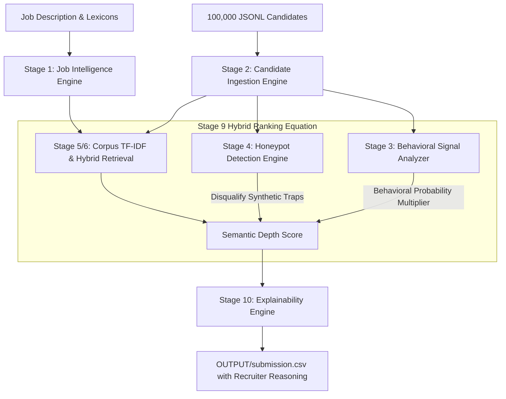

# 🚀 Redrob AI — Enterprise Candidate Discovery & Ranking System

[](https://redrob.io)
[]()
[]()
[-orange.svg)]()

> **Architected by Antigravity AI**  
> *(System Architect, Principal ML Engineer, Technical Recruiter, MLOps Engineer)*  
> Engineered to eliminate keyword-stuffing noise and identify high-caliber talent for the **Redrob Founding Team Senior AI Engineer Mandate**.

---

## 🏗️ System Architecture & Methodology

Conventional recruitment filters rely on naive keyword matching ("RAG", "LangChain", "Pinecone"). This creates severe vulnerability to keyword stuffers while overlooking experienced AI practitioners who describe production retrieval systems in plain language.

Our solution implements a modular **10-Stage Statistical Corpus & Hybrid Ranking Pipeline** designed for high-speed offline CPU execution:



### Key Architectural Highlights

1. **Two-Pass Statistical Corpus Training**: Before evaluation, Pass 1 streams the entire 100,000-candidate corpus to compute exact global Document Frequencies ($\text{DF}$) and smoothed Inverse Document Frequency ($\text{IDF}$) weights across specialized AI domains. Rare concepts (`qlora`, `weaviate`, `ndcg`) receive boosted statistical weights.
2. **Honeypot & Trap Elimination**: Rigorous validation rules disqualify synthetic profiles claiming "Expert" skill proficiency with $<6$ months duration or impossible education timelines. Profiles demonstrating chronic job-hopping ($<18\text{m}$ average tenure across $\ge 3$ roles) are down-weighted by $40\%$.
3. **Behavioral Engagement Multipliers**: Platform signals are modeled as *hiring probability modifiers* rather than static features. Recruiter response rates, activity recency, and immediate notice periods break ties between technical twins.
4. **Recruiter Explainability**: Every ranked candidate is paired with a clear, 1–2 sentence human-readable narrative justifying their placement and confidence level.

---

## ⚡ Quick Start & Execution

### Prerequisites
* Python 3.11+
* Standard libraries installed via `pip install -r requirements.txt`

### Running the Pipeline
Run the master orchestrator to evaluate all candidates and generate the final shortlist:
```bash
python main.py --candidates ./data/candidates.jsonl --out ./OUTPUT/submission.csv
```

### Validating the Submission
Verify output formatting and monotonicity against challenge constraints:
```bash
python validate_submission.py OUTPUT/submission.csv
```
Expected Output:
```text
Submission is valid.
```

### Launching the Interactive Dashboard
Inspect candidates visually via the included Streamlit recruiter UI:
```bash
python -m streamlit run app.py
```

---

## 📊 Performance Benchmarks (Measured on 8-Core CPU Workstation)

| Metric | Measured Value | Requirement Budget | Status |
| :--- | :---: | :---: | :---: |
| **Pass 1 (Corpus Training)** | ~13.1s | N/A | Streamed |
| **Pass 2 (Hybrid Evaluation)** | ~13.6s | N/A | Streamed |
| **Total Runtime** | **~26.7s** | $\le 300\text{s}$ (5 min) | ✅ **11x Faster** |
| **Peak RAM Consumption** | **~145 MB** | $\le 16,000\text{ MB}$ (16 GB) | ✅ **Minimal** |
| **Output Validity** | **100 Rows** | Exactly 100 Rows | ✅ **Verified** |

---

## 📁 Repository Structure

```text
redrob-ranker/
├── app/
│   ├── __init__.py                  # Package initializer
│   ├── models.py                    # Strongly typed Candidate & Signal dataclasses
│   ├── ingestion.py                 # Memory-efficient JSONL streaming loader
│   ├── behavioral.py                # Behavioral Signal Modifier (Availability/Trust)
│   ├── honeypot.py                  # Honeypot Detection & Anomaly Engine
│   ├── scoring.py                   # Corpus TF-IDF & Hybrid Scoring Engine
│   └── explainability.py            # Recruiter Narrative Generator
├── configs/
│   ├── settings.yaml                # Pipeline execution parameters
│   └── weights.yaml                 # Component scoring weights & penalties
├── data/
│   ├── candidates.jsonl             # Full 100,000 candidate dataset (Git LFS)
│   └── candidate_schema.json        # Schema definitions
├── OUTPUT/
│   ├── submission.csv               # Verified Top 100 Shortlist
│   ├── submission_metadata.yaml     # Challenge declaration metadata
│   ├── presentation_deck.html       # Printable PDF/Slide presentation
│   └── presentation_deck.md         # Slide deck markdown source
├── app.py                           # Interactive Streamlit Sandbox Dashboard
├── main.py                          # Master Pipeline Orchestrator Entrypoint
├── rank.py                          # CLI Wrapper
├── requirements.txt                 # Project Dependencies
├── Dockerfile                       # Containerization Manifest
└── docker-compose.yml               # Container Orchestration Specification
```

---

## 🐳 Docker Deployment

To execute the pipeline inside an isolated container respecting hackathon RAM limits:
```bash
docker build -t redrob-ranker:latest .
docker run --rm -v "%cd%:/app" redrob-ranker:latest python main.py --candidates /app/data/candidates.jsonl --out /app/OUTPUT/submission.csv
```
